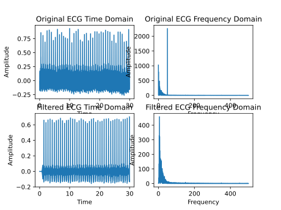

### ENG5027 Assignment 02 - FIR FIlters

- Team Members: Jinming Zhang (2639212z), Xiaohui Yu (2784582y), Jianyu Zhao (2721815z), Ziyuan Cheng (2786151c)

## Task 1: Design Filter

According to the description, functions to design the filter need to be implemented and functions should automatically
decide the num of coefficients. For exmaple, high pass filter just need one cutoff frequency, however, band stop
frequency should have two cutoff frequency. Due to characteristics of python, **dynamic language**, at runtime the code
can change its structure based on certain conditions, meanwhile, the data type is not determined at the compile stage,
but the **type binding** is postponed to the **runtime stage**.Therefore, incoming parameters can be consistent. What is
more, considering **scalability**, in order to not need to refactor the entire structure when a new filter needs to be
designed, define a base class `Filter` and a **abstract** method `_design_filter` is necessary. And then, because the
process of high pass filter is same as band stop filter's, the method to filter can be defined in super class, when a
filter need a different function to filter, it is easy to **overload** it in specific derived class.

## I. Define the super class, FirFilter

### Step

1. Define a constructor, according to h(n) to init the buffer used in process of filter.

    ```python
    class FirFilter:
        def __init__(self, _h):
            self.h = _h
            self.M = len(_h)
            # Ring buffer
            self.buffer = np.zeros(self.M)
            self.offset = self.M - 1
    ```

1. Define a private abstract design function which need every derived class to implement since this function is not
   expected to be called by the outside.

    ```python
    # Abstract design method
    @abc.abstractmethod
    def _design_filter(self, w):
        pass
    ```

1. Define filter functions, including a real time filter function and entire filter function. In order to improve
   efficiency, to use a **loop array** and a **offset** to implement a buffer.

    ```python
    # Real time filter
    def _do_filter(self, input):
        self.buffer[self.offset] = input
        # Move the offset
        self.offset -= 1
        if self.offset < 0:
            self.offset = self.M - 1
        # Calculate the output
        output = 0
        for i in range(self.M):
            output += self.h[i] * self.buffer[(i + self.offset) % self.M]
        return output
    
    # Entire filter
    def do_total_filter(self, input):
        n = len(input)
        output = np.zeros(n)
        for i in range(n):
            output[i] = self._do_filter(input[i])
        return output
    ```

## II. Define the derived class, HighPassFilter

### Step

1. Define a constructor, need to call the constructor of the super class.

    ```python
    class BandStopFilter(FirFilter):
      def __init__(self, _sample_rate, _w_1, _w_2, _freq_resolution=1):
        self.sample_rate = _sample_rate
        self.freq_resolution = _freq_resolution
        h = self._design_filter([_w_1, _w_2])
        super().__init__(h)
    ```

1. Implement the design function using IFFT and hamming window.

   ```python
   def _design_filter(self, w):
     fs = self.sample_rate
     M = int(fs / self.freq_resolution)
     w_1 = int(w[0] / fs * M)
     w_2 = int(w[1] / fs * M)
     # Define the ideal frequency response
     X = np.ones(M)
     X[w_1:w_2 + 1] = 0
     X[M - w_2:M - w_1 + 1] = 0
     # Compute h(n) using the inverse FFT
     x = np.fft.ifft(X)
     x = np.real(x)
     # Mirror h(n)
     h = np.zeros(M)
     h[0:int(M / 2)] = x[int(M / 2):M]
     h[int(M / 2):M] = x[0:int(M / 2)]
     # Window h(n) using a Hamming window
     h = h * np.hamming(M)
   
   return h
   ```

## III. Define the derived class, BandStopFilter

### Step

1. Define a constructor, need to call the constructor of the super class.

     ```python
     class HighPassFilter(FirFilter):
         def __init__(self, _sample_rate, _w_c, _freq_resolution=1):
             self.sample_rate = _sample_rate
             self.freq_resolution = _freq_resolution
             h = self._design_filter(_w_c)
             super().__init__(h)
     ```

1. Implement the design function using IFFT and hamming window.

     ```python
     def _design_filter(self, w):
         fs = self.sample_rate
         M = int(fs / self.freq_resolution)
         w_c = int(w / fs * M)
         # Define the ideal frequency response
         X = np.ones(M)
         X[0:w_c + 1] = 0
         X[M - w_c:M + 1] = 0
         # Compute h(n) using the inverse FFT
         x = np.fft.ifft(X)
         x = np.real(x)
         # Mirror h(n)
         h = np.zeros(M)
         h[0:int(M / 2)] = x[int(M / 2):M]
         h[int(M / 2):M] = x[0:int(M / 2)]
         # Window h(n) using a Hamming window
         h = h * np.hamming(M)
     
         return h
     ```

## IV. Define the derived class, LmsFilter

### Step

1. Define a constructor, need to call the constructor of the super class.

   ```python
   class LmsFilter(FirFilter):
       def __init__(self, _sample_rate, _freq_resolution=1):
           self.sample_rate = _sample_rate
           self.freq_resolution = _freq_resolution
           h = self._design_filter(None)
           super().__init__(h)
   ```

1. Implement the design function using no other parameter but sampe rate.

   ```python
   def _design_filter(self, w):
       h = np.zeros(int(self.sample_rate / self.freq_resolution))
       return h
   ```

1. Overland the filter function, lms filter need calculate a error between input and noise. In addition, because of **
   loop array** to implement the buffer, need to use **offset** to update the h(n)

   ```python
   def _do_filter(self, input, noise=None):
       # Calculate thr error
       canceller = super()._do_filter(noise)
       output = input - canceller
       # Update the h(n)
       for i in range(self.M):
           self.h[i] += output * self.learning_rate * self.buffer[(i + self.offset) % self.M]
       return output
   
   def do_total_filter(self, input):
       n = len(input)
       output = np.zeros(n)
       for i in range(n):
           noise = np.sin(2.0 * np.pi * self.noise_freq / self.sample_rate * i)
           output[i] = self._do_filter(input[i], noise)
       return output
   ```

<div style="page-break-after:always"></div>

## Task 2:

```python
import matplotlib.pyplot as plt
import numpy as np

import constant
import util
from firfilter import BandStopFilter, HighPassFilter
```

1. Creating band-stop filter and high-pass filter  
   In Task1, the functions band-stop filter and high-pass filter have been created. Therefore, they can be called directly here.

2. Removing the 50Hz interference by the band-stop filter  
   The topic requires using a band-stop filter to filter out 50hz of noise.

3. Process the baseline wander by the high-pass filter  
   Baseline wander is eliminated by utilizing a high-pass filter. Because if the baseline wander is not eliminated, then the trend term is treated as the original signal acquired, affecting the accuracy of the signal and the subsequent data processing results.

4. Ploting the time domain frequency domain before and after filtering  

5. Observation of the image shows that the 50hz is correctly filtered

   ```python
   if __name__ == '__main__':   
       band_stop_w_1 = 49
       band_stop_w_2 = 51
       high_pass_w_c = 2
       original_data = np.loadtxt(constant.file_path)
       n = len(original_data)
       # Create band-stop filter
       band_stop_filter = BandStopFilter(constant.sample_rate, band_stop_w_1, band_stop_w_2)
       # Create high-pass filter
       high_pass_filter = HighPassFilter(constant.sample_rate, high_pass_w_c)
       # Remove the 50Hz interference by the band-stop filter
       filtered_data = band_stop_filter.do_total_filter(original_data)
       # Process the baseline wander by the high-pass filter
       filtered_data = high_pass_filter.do_total_filter(filtered_data)
       # Plot the original ECG time domain
       original_time, original_amplitude = util.cal_time_domain(original_data, constant.sample_rate)
       plt.subplot(2, 2, 1)
       plt.plot(original_time, original_amplitude)
       plt.title('Original ECG Time Domain')
       plt.xlabel("Time")
       plt.ylabel("Amplitude")
       # Plot the original ECG frequency domain
       original_freq, original_amplitude = util.cal_frequency_domain(original_data, constant.sample_rate)
       plt.subplot(2, 2, 2)
       plt.plot(original_freq, original_amplitude)
       plt.title('Original ECG Frequency Domain')
       plt.xlabel("Frequency")
       plt.ylabel("Amplitude")
       # Plot the filtered ECG time domain
       filtered_time, filtered_amplitude = util.cal_time_domain(filtered_data, constant.sample_rate)
       plt.subplot(2, 2, 3)
       plt.plot(filtered_time, filtered_amplitude)
       plt.title('Filtered ECG Time Domain')
       plt.xlabel("Time")
       plt.ylabel("Amplitude")
       # Plot the filtered ECG frequency domain
       filtered_freq, filtered_amplitude = util.cal_frequency_domain(filtered_data, constant.sample_rate)
       plt.subplot(2, 2, 4)
       plt.plot(filtered_freq, filtered_amplitude)
       plt.title('Filtered ECG Frequency Domain')
       plt.xlabel("Frequency")
       plt.ylabel("Amplitude")
       plt.tight_layout()
       plt.savefig("res/task_2.svg")
       plt.show()
   ```

   

<div style="page-break-after:always"></div>

## Task 3:

<div style="page-break-after:always"></div>

## Task 4:

<div style="page-break-after:always"></div>

## Appendix:

Here is the GitHub repository link of this project: https://github.com/DSP-Lab-Group/Lab-02-FIR

